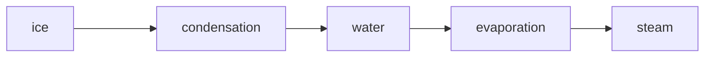
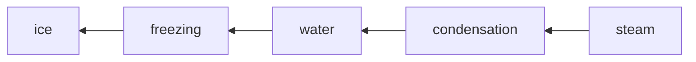

# Syntax for Note-taking Features  
This is an explanation of how the readme page was created and what each feature does and how it does that.

-It also has a feature to add links and reirect you to different pages. For creating the clickable link we enclode within "[]" and then the "()" contain the actual link.  
-Another cool feature is that you can make a table or chart format sort of using pipeline. "|"

### Table of Contents
| Sl. No.| Topic or Contents | Hours |
|--------|-------------------|-------|
| 1. | [Web Development Notes](./webdev.md) | 100+ Hours |
| 2. | [C Programming Notes](./Clanguage.md) | 10 Hours |
| 3. | [DSA Notes](./Clanguage.md) | 90 Hours |  


-There is a feature to use or make changes in your repo directly from VS Code by pressing "." in your github page and it will directly open an online VS Code page for you. This line of commit was made through VS Code itself.  
-We can also make: 1) Add a codeblock in our readme using "```" file 
                   2) make a flowchart using the mermaid fucntion under the "```" codeblock

```
This is a codeblock
```
### Making a Flowchart




