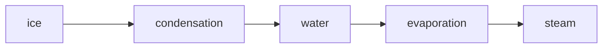
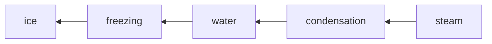

# My Notes

### Using GitHub for my Personal Note-taking

This is my first GitHub commit.  
-I am learning how to make a commit on GitHub and use it as my personal notetaking software. [Here](./notessyntax.md) You can find how and why these features were used. 

### Table of Contents
| Sl. No.| Topic or Contents | Hours |
|--------|-------------------|-------|
| 1. | [Web Development Notes](./webdev.md) | 100+ Hours |
| 2. | [C Programming Notes](./Clanguage.md) | 10 Hours |
| 3. | [DSA Notes](./Clanguage.md) | 90 Hours |  

```
This is a codeblock
```
### Making a Flowchart



### Other Features
- You can also use the wiki feature if you don't want too many readme files on the main page
- You can make use of the "ISSUES" tab as your reminders, that you have to do this, fix this, etc. 
